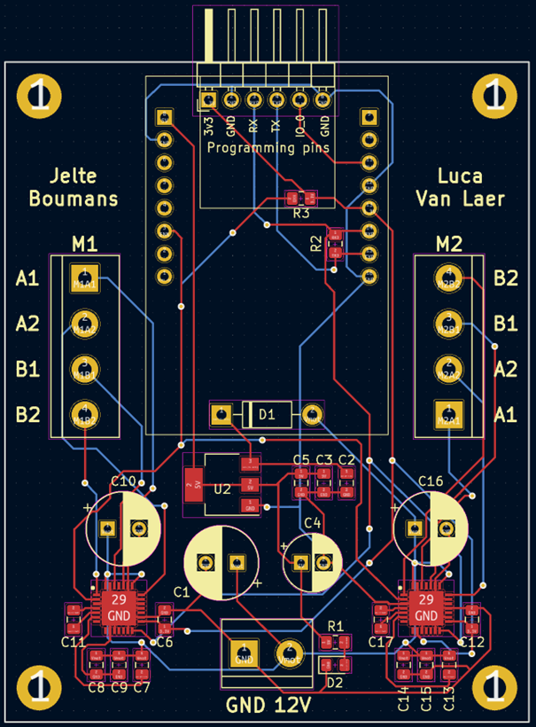

# Probleemstelling
Binnen het Farmlab project wordt gebruikt gemaakt van een camera module. Deze camera neemt foto's van de groeiende planten voor remote monitoring en AI computer vision. Om de camera rond te bewegen wordt er gebruik gemaakt van een XY systeem.

Dit XY systeem is van het type CoreXY. Daarin wordt een centrale sled rondbewogen door middel van 2 riemen. De riemen zijn ieders verbonden aan een stappenmotor.

## Vereisten
Om dit project te definieren gaan we enige vereisten aflijnen:
 - Het XY systeem kalibreert zich automatisch naar een nulpunt.
 - De gebruiker kan het systeem monitoren en besturen van een centraal dashboard.
 - De gebruiker kan het systeem manueel besturen of automatisch een route laten nemen.
 - De foto's moeten op een server worden opgeslagen voor later gebruik bij een AI model.
 - De server moet dienen als MQTT broker voor de communicatie met het systeem.

## Ontwikkelingsplan
Jelte zal de verdere fysieke uitwerking van het XY systeem behandelen. De deeltaken betreffen hier: 
 - De TMC Stallguard functie verder onderzoeken in het kader van het vervangen van de limit switches. De werking hiervan is al gekend, we moeten nog enkel onderzoeken hoe dit kan toegepast worden in de software door het gebruik van de TMC-bibliotheek. 
 - Een proper en functioneel NodeRed dashboard ontwikkelen. Omvat vooral het integreren van de automatische route. Deze automatische route zal worden gestart door te drukken op een knop.
 - Een automatisch kalibratiesysteem ontwikkelen op basis van de Stallguard functie indien deze werkend geraakt. Indien niet gebruiken we de aanwezige aansluitingen voor limit switches.
 - De automatische route voor het XY systeem programmeren op basis van voorafgaande kalibratie. Door deze automatische route zal de camera langs elke plant gaan en daarvan een foto nemen. De foto’s worden dan naar de database gestuurd.

Luca zal de integratie van het camerasysteem behandelen. De deeltaken betreffen hier:
 - Software ontwikkelen die de camera duidelijke foto’s laat trekken, met als formaat een frame buffer met JPEG data.
 - Software ontwikkelen om de frame buffers, in JPEG vorm te hercoderen naar een base64 string.
 - De voorafgaande base64 via MQTT kunnen doorsturen naar een andere client, met voorkeur een NodeRed pagina.
 - Software ontwikkelen om de base64 string op te slagen in een SQLITE-database om deze naar het AI systeem te geven en om een galerij op te bouwen.
 - Een NodeRed pagina ontwikkelen waar foto’s op worden getoond die uit de JSON-database komen. De base64 string moet dus correct worden gedecodeerd om een foto te kunnen tonen. Dit zou geen probleem moeten zijn aangezien HTML image tags base64 kunnen accepteren. De browser decodeert dan de foto.

## Infrastructuur
Het systeem werkt met 2 apparaten: 
 - De ESPCAM module, die het systeem fysiek aanstuurt (stappenmotoren, camera, etc.).
 - De lokale server, die MQTT communicatie en web-app hosting behandeld.

### ESPCAM module
De ESPCAM module is een PCB die de functionaliteit van een ESP32-CAM bordje en twee TMC2209 stepper drivers samenvoegt.

De ESP32-CAM bevat een camera, SD-kaart houder en ESP32-WROVER module voor processing en draadloze functionaliteit.
De TMC2209 stepper drivers bevatten een seriëel interface, mogelijkheid tot 1/256 microstepping en een 'Stallguard' piekstroom detectie systeem. Het Stallguard systeem laat ons toe om enige limit switches te verwijderen van het design. Deze functie zal aangeven wanneer de motor vast loopt (einde loop).

### Lokale server
De lokale server draait alle functionaliteit binnen een docker container van Debian Linux. Binnen deze container draait een mosquitto MQTT broker en een NodeRed dashboard host.

# Doelen

Vorig semester zijn we begonnen aan de ontwikkeling van het XY systeem. Het resultaat hiervan was een simpel prototype en een PCB. De PCB moet nog bestukt en getest worden. De geautomatiseerde route moet worden geprogrammeerd. Ten slotte moet de camera nog geïntegreerd worden in het systeem. We gaan het werk verdelen als volgt.

## Doelen – Jelte

Jelte zal de verdere fysieke uitwerking van het XY systeem behandelen. De deeltaken betreffen hier:

- De TMC Stallguard functie verder onderzoeken in het kader van het vervangen van de limit switches. De werking hiervan is al gekend, we moeten nog enkel onderzoeken hoe dit kan toegepast worden in de software door het gebruik van de TMC-bibliotheek.
- Een proper en functioneel NodeRed dashboard ontwikkelen. Omvat vooral het integreren van de automatische route. Deze automatische route zal worden gestart door te drukken op een knop.
- Een automatisch kalibratiesysteem ontwikkelen op basis van de Stallguard functie indien deze werkend geraakt. Indien niet gebruiken we de aanwezige aansluitingen voor limit switches.
- De automatische route voor het XY systeem programmeren op basis van voorafgaande kalibratie. Door deze automatische route zal de camera langs elke plant gaan en daarvan een foto nemen. De foto's worden dan naar de database gestuurd.

## Doelen - Luca

Luca zal de integratie van het camerasysteem behandelen. De deeltaken betreffen hier:

- Software ontwikkelen die de camera duidelijke foto's laat trekken, met als formaat een frame buffer met JPEG data.
- Software ontwikkelen om de frame buffers, in JPEG vorm te hercoderen naar een base64 string.
- De voorafgaande base64 via MQTT kunnen doorsturen naar een andere client, met voorkeur een NodeRed pagina.
- Software ontwikkelen om de base64 string op te slagen in een SQLITE-database om deze naar het AI systeem te geven en om een galerij op te bouwen.
- Een NodeRed pagina ontwikkelen waar foto's op worden getoond die uit de JSON-database komen. De base64 string moet dus correct worden gedecodeerd om een foto te kunnen tonen. Dit zou geen probleem moeten zijn aangezien HTML image tags base64 kunnen accepteren. De browser decodeert dan de foto.

## Doelen - Extra

Een paar extra taken die kunnen gemaakt worden indien er tijd over is zijn als volgt:

- Een rework van de PCB om de limit switches te verwijderen (indien de Stallguard functie werkt).
- Een rework van de bestaande ge-3D-printe onderdelen van het XY systeem. Dit zijn onder andere:
  - Het onderdeel dat gebruikt wordt om de band op te spannen.
  - De bevestigingsstukken die in de bovenhoeken het kader bijeen houden en de riemen naar beneden geleiden.
  - De bevestigingsstukken voor de motoren.

# Bronnen

- [TMC2209-LA Datasheet](https://www.trinamic.com/fileadmin/assets/Products/ICs_Documents/TMC2209_Datasheet_V103.pdf)
- ESP-CAM voorbeeld code voor gebruik van de camera module.