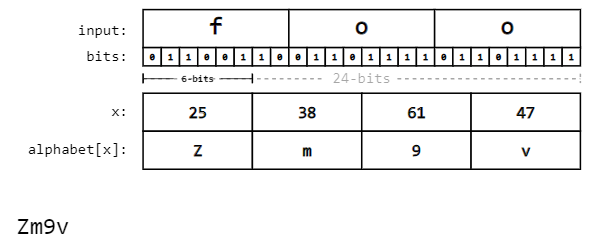
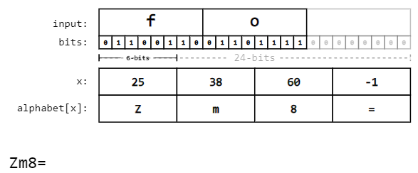

# Camera

We gebruiken de OV2640 camera module die op de ESPCAM staat.


## Setup
Ten eerste moet de OV2640 correct opgezet worden. Hier bestaan online allerhande gidsen voor en er is een bibliotheek die ons helpt om de camera aan te spreken.

We beginnen met een de bibliotheek te importeren en een paar termen te definiëren. Dit zijn de verschillende pins om de module te besturen. Ten slotte maken we een object aan waar de frame buffer/foto ingestoken wordt.
```cpp
#include "esp_camera.h"

// OV2640 camera module pins
#define PWDN_GPIO_NUM     32
#define RESET_GPIO_NUM    -1
#define XCLK_GPIO_NUM      0
#define SIOD_GPIO_NUM     26
#define SIOC_GPIO_NUM     27
#define Y9_GPIO_NUM       35
#define Y8_GPIO_NUM       34
#define Y7_GPIO_NUM       39
#define Y6_GPIO_NUM       36
#define Y5_GPIO_NUM       21
#define Y4_GPIO_NUM       19
#define Y3_GPIO_NUM       18
#define Y2_GPIO_NUM        5
#define VSYNC_GPIO_NUM    25
#define HREF_GPIO_NUM     23
#define PCLK_GPIO_NUM     22

camera_fb_t * fb = NULL;
```

In de setup assignen we de pins aan een config object en testen we de initialisatie van de camera. Wanneer dat de initialisatie gebeurd is, wachten we best een aantal seconden zodat de sensor kan kalibreren. Foto's zullen anders zwaar groen getint zijn.
```cpp
void setup() {
  camera_config_t config;
  config.ledc_channel = LEDC_CHANNEL_0;
  config.ledc_timer = LEDC_TIMER_0;
  config.pin_d0 = Y2_GPIO_NUM;
  config.pin_d1 = Y3_GPIO_NUM;
  config.pin_d2 = Y4_GPIO_NUM;
  config.pin_d3 = Y5_GPIO_NUM;
  config.pin_d4 = Y6_GPIO_NUM;
  config.pin_d5 = Y7_GPIO_NUM;
  config.pin_d6 = Y8_GPIO_NUM;
  config.pin_d7 = Y9_GPIO_NUM;
  config.pin_xclk = XCLK_GPIO_NUM;
  config.pin_pclk = PCLK_GPIO_NUM;
  config.pin_vsync = VSYNC_GPIO_NUM;
  config.pin_href = HREF_GPIO_NUM;
  config.pin_sscb_sda = SIOD_GPIO_NUM;
  config.pin_sscb_scl = SIOC_GPIO_NUM;
  config.pin_pwdn = PWDN_GPIO_NUM;
  config.pin_reset = RESET_GPIO_NUM;
  config.xclk_freq_hz = 20000000;
  config.pixel_format = PIXFORMAT_JPEG;
  config.frame_size = FRAMESIZE_SVGA;
  config.jpeg_quality = 12;
  config.fb_count = 1;

  // Init Camera
  esp_err_t err = esp_camera_init(&config);
  if (err != ESP_OK) {
    Serial.printf("Camera init failed with error 0x%x", err);
    return;
  }
}
```


## Foto nemen
Het nemen van een foto gebeurt door simpelweg de frame buffer te vullen met het resultaat van een functie uit de bibliotheek
```cpp
fb = esp_camera_fb_get();
```


## Foto converteren
Nu dat er een foto in de frame buffer zit moeten we deze converteren om ze door te sturen. Ik heb besloten om de foto te converteren naar een base64 representatie. 

### Base64
Base64 is een encoderingsformaat waar dat alle bits van een stuk data op een rij worden gezet. Men begint aan de MSB en telt 6 bits. Deze bits worden geconverteerd naar een karakter uit een 64 karakter alfabet. Zo tel je verder tot dat de reeks afgemaakt is. De cyphertext is dus altijd langer dan de plaintext.



```cpp
#define ALPHABET "ABCDEFGHIJKLMNOPQRSTUVWXYZabcdefghijklmnopqrstuvwxyz0123456789+/"
```

Maar wat als we een reeks bits hebben dat niet deelbaar is door 6? Dan is er padding nodig. Er worden aan het einde van de bitreeks (na de LSB dus) een aantal 0'en toegevoegd. Genoeg om het laatste karakter in de reeks aan te vullen en om een extra "padding" karakter toe te voegen. In base64 is dit karakter het gelijkheidsteken '='.



```cpp
#define PAD '='
```

### Conversie algoritme
Er bestaan niet direct bibliotheken om een frame buffer met pixeldata om te zetten naar een base64 string. Maar met de kennis van base64 die hiervoor is uitgelegd, is het redelijk makkelijk om een conversie algoritme te maken.

We hebben een aantal variabelen nodig: 
- Een tijdelijke buffer voor de drie bytes die we converteren.
- Een tijdelijke buffer voor de resulterende 4 karakters. 
- Een index om het 64 karakter alfabet aan te spreken.
- Een byte om onze tel binnen het conversieproces te kunnen houden bij padding.
- Een bool om te laten weten dat padding nodig is
```cpp
byte imgdata[3];
char based[4];
byte index = 0;
byte convint = 0;
bool pad = false;
```

We willen dit proces lang genoeg volhouden om de volledige frame buffer te overlopen. We moeten dus even de lengte van de huidige buffer aan pixeldata opvragen.
```cpp
for(size_t bufi = 0; bufi < fb->len; bufi+=3)
```

De eerste stap binnen onze loop is de juiste pixeldata uit de buffer halen. We halen telkens de huidige index (bufi) plus de volgende 2 bytes uit de buffer. Met die 3 bytes kunnen we dan converteren. Als we niet genoeg bytes in de buffer hebben, hebben we padding nodig.
```cpp
for(byte i = 0; i < 3; i++) {
	imgdata[i] = fb->buf[bufi + i];
	if((bufi + i) == fb->len) {
		convint = i;
        pad = true;
		break;
	}
}
```

Nu volgt het werkelijke conversieproces. We gebruiken bitmasks om telkens 6 bits te nemen en in onze index te steken. We moeten deze nog wel juist shiften om ervoor te zorgen dat we exact een 6 bit waarde hebben. Daarna kunnen we deze index gebruiken om uit het alfabet het juiste karakter te halen.
```cpp
index = imgdata[0] & 0b11111100;
index = index >> 2;
based[0] = ALPHABET[index];
  
index = ((imgdata[0] & 0b00000011) << 4) + ((imgdata[1] & 0b11110000) >> 4);
based[1] = ALPHABET[index];
      
index = ((imgdata[1] & 0b00001111) << 2) + ((imgdata[2] & 0b11000000) >> 6);
based[2] = ALPHABET[index];
  
index = imgdata[2] & 0b00111111;
based[3] = ALPHABET[index];
```

Padding toevoegen is minder simpel. Ten eerste moeten we weten waar in het conversieproces dat we zitten. Anders voegen we te weinig of te veel padding toe. Dan voegen we de juiste padding toe en berekenen we de laatste karakters.
```cpp
switch(convint) {
	case 0:
		imgdata[1] = 0;
		imgdata[2] = 0;
		based[3] = '=';
        based[4] = '=';

        index = imgdata[0] & 0b11111100;
        index = index >> 2;
        based[0] = ALPHABET[index];
      
        index = ((imgdata[0] & 0b00000011) << 4) + ((imgdata[1] & 0b11110000) >> 4);
        based[1] = ALPHABET[index];
        break;
          
	case 1:
        imgdata[2] = 0;
        based[3] = '=';

        index = imgdata[0] & 0b11111100;
        index = index >> 2;
        based[0] = ALPHABET[index];
      
        index = ((imgdata[0] & 0b00000011) << 4) + ((imgdata[1] & 0b11110000) >> 4);
        based[1] = ALPHABET[index];
          
        index = ((imgdata[1] & 0b00001111) << 2) + ((imgdata[2] & 0b11000000) >> 6);
        based[2] = ALPHABET[index];
        break;
}
```

Ten slotte voegen we de geconverteerde karakters toe aan een string om na het conversieproces door te sturen.
```cpp
for(byte i = 0; i < 4; i++) {
	pic_str += based[i];
}
```


## Foto versturen
We versturen de foto met MQTT naar de server. Er is nog wel een zaak dat aangepast moet worden. De PubSubClient bibliotheek, die we gebruiken voor MQTT, heeft een standaard buffergrootte van 128 bytes. Dit volstaat voor de meeste transacties maar onze bas64 string is veel groter dan 128 bytes. We moeten dus de buffer even aanpassen naar de lengte van onze frame buffer. We voegen nog enkele bytes toe als tolerantie.
```cpp
client.setBufferSize(pic_str.length()+128);
```

Deze string kan dan gewoon gepublished worden op de juiste topic. Het is aangeraden om even te controleren dat de client zeker verbonden is voor dat de string wordt doorgestuurd.
```cpp
if (!client.connected()) {
	reconnect();
}

client.publish(topic, (char*)pic_str.c_str());
```
