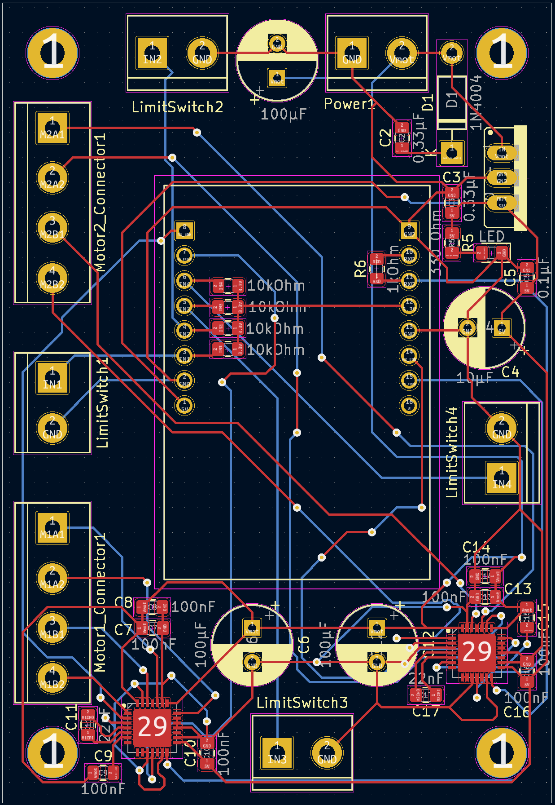
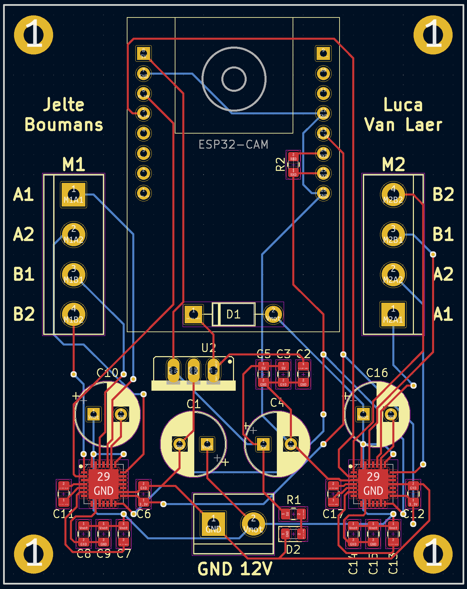
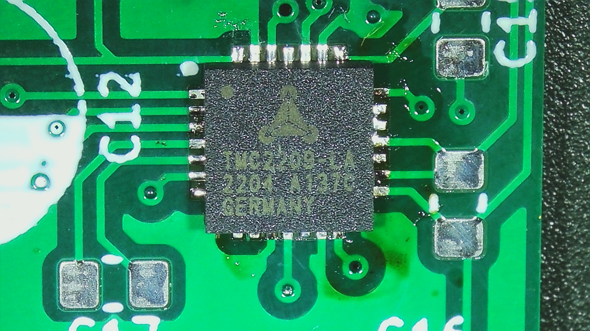
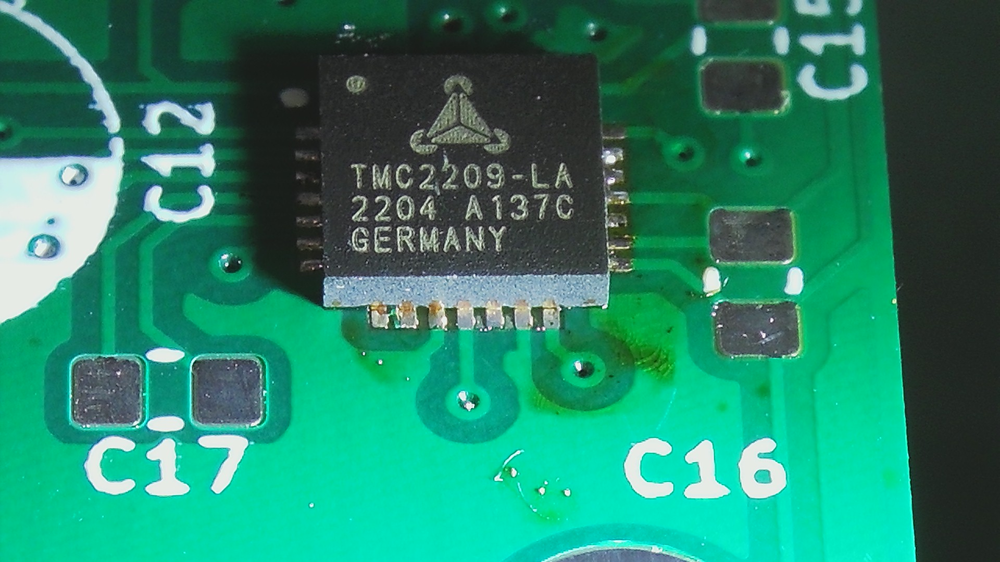
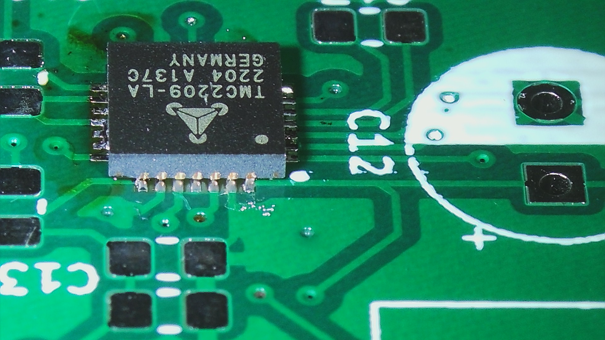
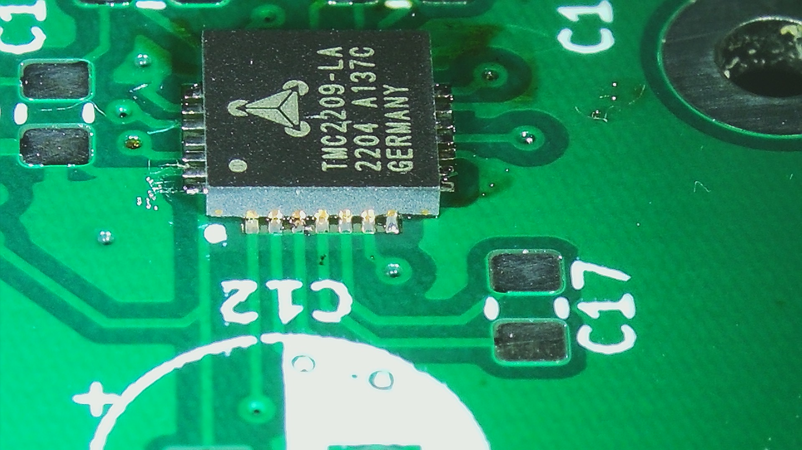
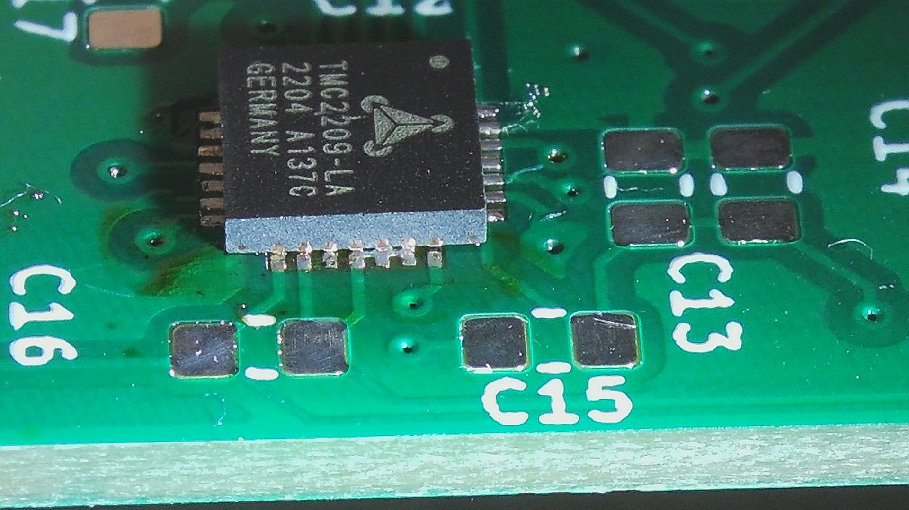

# PCB

In de span van dit semester hebben we 3 verschillende PCB's gebruikt en gestest. Hier is een korte samenvatting van elke PCB en de aanpassingen en fouten bij elke iteratie.

## PCB V1

Dit is de PCB waarmee we het semester zijn mee begonnen. Deze PCB was gemaakt vorig jaar maar we hadden deze nog niet helemaal kunnen testen door de late levering van de TMC2209 chips. Omdat we wisten dat we zeker een nieuwe PCB gingen maken dit semester konden we deze PCB tenminste nog gebruiken als soldeer oefening om de TMC2209 te solderen, aangezien niemand van ons ervaring had met QFN.

_PCB schema 1_

## PCB V2

Hier is de eerste PCB die we hebben ontworpen dit semester. Deze heeft een complete redesign gekregen voor enkele redenen:

- In de vorige PCB was het symbool van de ESP-CAM omgekeerd dus moesten we een nieuwe hiervoor maken.
- De limit switches werden irrelevant in ons project, dus de schroefconnectoren voor deze schakelaars mochten dan weg.

Met deze PCB waren we erin geslaagd om te kunnen communiceren met de TMC2209. Maar er zijn nog enkele fouten in deze PCB, daarom dat er nog een 3de versie is gemaakt.

_PCB schema 2_

## PCB V3

Dit is de finale versie van onze PCB voor dit semester. De fouten die we van de vorige PCB hebben verbeterd zijn als volgt:

- Beide TMCs moeten normaal voorzien zijn van 2 verschillende slave adressen, dit waren we vergeten en hadden ze allebei het adres "00" gegeven. Hierdoor konden we ze niet individueel aansturen. Nu hebben ze de adressen "00" (links) en "01" (rechts).
- De weerstand R2 zorgt voor de 1-wire UART,het is belangrijk dat de TX door de weerstand gaat en de RX langs de weerstand. Deze informatie staat in de datasheet, deze foto staat ook bij [UART Interface](./tmc.md). Dit hadden we verwaarloosd en verkeerd verbonden, in deze PCB is dit geen probleem meer.

Er zijn ook extra aanpassingen die we hebben gemaakt aan de PCB, dit waren geen fouten in de vorige PCB, maar dingen die we vonden dat nog aangepast konden worden of toegevoegd:

- De spanningsregelaar veranderen naar SMD component i.p.v. een THT componenten.
- Omdat de ESP-CAM geen USB heeft om te programmeren moet deze door een andere ESP of Arduino geprogrammeerd worden. Programming pins toevoegen bespaart ons de tijd om elke keer de ESP-CAM uit de PCB te halen en terug in te steken.
- Een pullup weerstand aan de ENN pin van de TMCs en die kan laag worden getrokken door een IO pin van de ESP-CAM. Deze is nodig om de TMCs later pas te starten, als we dit niet zouden doen dan verscheen er een grote current spike elke keer dat de voeding werd aangesloten (3A voor een +- 1 seconden).

_PCB schema 3_

Maar ook al was communicatie mogelijk en succesvol in de 2de PCB, kregen we geen communicatie met de TMC vastgesteld met deze PCB. We hebben meerdere lessen de PCB zitten debuggen maar we hebben geen reden kunnen vinden waarom communicatie met de TMC niet successvol was. De dingen die we hebben geprobeerd zijn als volgt:

- De TMC meerdere keren gesoldeerd, verschillende TMC chips op verschillende plaatsen op verschillende PCBs met elks hetzelfde resultaat.
- Elke keer dat we een TMC zouden solderen zouden we elke connectie nakijken met een microscoop. Elke keer zag elke connectie er goed uit in onze ogen, maar het resultaat bleef hetzelfde.
- Elke connectie nameten met een oscilloscoop om te controlleren of alle spanningen goed aankomen bij elke pin van elke chip.
- Met een logic analyser de UART signalen nameten om te zien wat voor data verstuurd wordt. Dit is het resultaat van de metingen:

_Resultaat bij PCB 2_

_Resultaat bij PCB 3_

Bij de 2de PCB wordt er duidelijk data verstuurd tussen de TMC en ESP. Maar bij de 3de PCB word er een geen data verstuurd. De reden hiervoor hebben we uiteindelijk niet kunnen vinden wat zeer spijtig is. Maar we hebben tenslotte nog wel een werkende opstelling kunnen maken met de breakout boards die ook een TMC2209 gebruiken.

Mogelijke oplossingen voor het probleem zouden volgens ons kunnen zijn:

- Gewoon de breakout boards gebruiken op de PCB i.p.v. de chips.
- Het lijkt er op dat het probleem toch ligt bij de solderingen. Het is zeer moeilijk en onbetrouwbaar om een QFN chip te solderen zonder gebruik te maken van een stencil. Als we een stencil hadden kunnen gebruiken had het resultaat misschien anders geweest.

## QFN Soldering

Tijdens de assemblage van de PCBs hebben we wel wat kunnen leren over het bevestigen van QFN packages. QFN staat voor Quad Flat No leads. Dit betekend dat het een vlakke package is met pins aan alle 4 kanten en zonder uitstekende pins. De pins zitten dus vlak tegen de onderkant van de package. De beste methode om een QFN te solderen is door soldeerpasta aan te brengen aan de footprint door middel van een stencil en dan na plaatsing van de component, deze in een soldeeroven af te bakken.

Aangezien we geen stencil hadden, moesten we dit op een andere manier oplossen. We hebben de volgende werkmethode bedacht op basis van video's en tips van het internet:
- Rijkelijk flux aanbrengen aan de footprint.
- Soldeertin aanbrengen aan een fijne soldeerbout tip.
- Snel met de tip van de soldeerbout over de pads van de footprint wrijven.
- Waar nodig even de soldeertin reduceren om foute verbindingen te verwijderen.
- Voorzichtig de component op de footprint plaatsen door middel van een microscoop en twee pincetten.
- Met een hete lucht pistool rond 350C en een trage airflow rustig de component en footprint warm maken.
- Wanneer de soldeertin gesmolten is, rustig de component recht naar beneden duwen om goed contact te maken met de PCB.
- Na dat de soldeertin terug gestolt is, even met een microscoop alle pins nakijken om goede bevestiging vast te stellen.

Met deze werkmethode hebben we goede resultaten gekregen. Een paar foto's zijn hieronder te zien:

